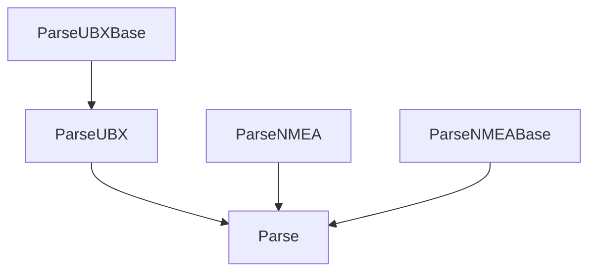

# Lang C++

TODO: What is this...

It is easiest to look at an example. 

```cpp
// File lang/cpp/src/MON.h
// Auto-generated by generateCpp.py v0.1 on 2017-10-30T16:56:07.208773

#include <stdint.h>
#include "UBX.h"

struct MON
{
    struct VER;
};

struct MON::VER
{
    char swVersion[30];
    char hwVersion[10];
    struct Repeated {
        char extension[30];
    };
    typedef _iterator<MON::VER::Repeated> iterator;
    static _iterator<Repeated> iter(char*data, size_t size) {
        return _iterator<Repeated>(data+sizeof(MON::VER), size-sizeof(MON::VER));
    }
};
```

It is easy enough to automatically create the appropriate `struct`s since the UBX types map directly onto C types. The only complication comes from the repeated blocks that give rise to variable length messages. We don't want to use `vector` or other STL containers because they are not  suited for microcontrollers, usually. Instead, iterators are used. They do not have the STL compatible`begin()` and `end` functions.

The data structure corresponding to each UBX message is just the sequence of non-repeated fields packed into a struct. The repeated fields are accessed by an iterator.

The iterator is instantiated with a pointer to the data and the length of the data.

```c++
MON::VER::iterator i=MON::VER:iter(data, size);
```

The data needs to be allocated in advance (no range checking is performed!).

Data is accessed with the `*` and `->` operators

```c++
char* ext = iter->extension;
```

### Class Structure

Both NMEA and UBX messages have a layered structure, i.e. the payload is wrapped inside a control structure that includes a checksum and, for UBX, message iedntification and length. The C++ classes follow this nested structure. Both `ParseNMEABase` and `ParseUBXBase` run a small FSM.

#### NMEA parsing

NMEA parsing isn't really the main goal of this library, but for getting started and for debugging it's good to be able to parse at least some of the NMEA messages. The modular design allows slicing in of more complete NMEA parsing libraries, if necessary.

Class `ParseNMEABase` iteratively parses each character and when a complete NMEA message is received and the checksum is validated the `onNMEA` callback is called.

```c++
// parseNMEABase.h
class ParseNMEABase
{
public:
    // Constructor. 
    ParseNMEABase(char* const buf, const size_t BUFLEN);
    
    // Parse one new byte.
    bool parse(uint8_t);

    // NMEA callback. You must implement this in a derived class.
    // buf is guaranteed to be a null-terminated string.
    virtual void onNMEA(char buf[], size_t len) = 0;
    
    // NMEA error callback
    // Override this function if needed.
    virtual void onNMEAerr() {};
};
```

Class `ParseNMEA` then parses the NMEA payload and calls the appropriate callback such as `onGGA`. `ParseNMEA` and `ParseNMEABase` are composed by inheriting from both and implementing the `onNMEA` callback which then calls `ParseNMEA.parse`.

```c++
// parseNMEA.h
class ParseNMEA
{
public:
  	// Parse one new byte.
    void parse(char buf[], size_t max_len);

    // GGA callback 
    virtual void onGGA(
        uint32_t utc, 
        float    lat, 
        float    lon,
        uint8_t  qual,
        uint8_t  n_satellites,
        float    hdil,
        float    alt,
        float    height
    );
    virtual void onError(char buf[], size_t len) {};
};
```

#### UBX Parsing

Class `ParseUBXBase` iteratively parses each character and when a complete UBX message is received and the checksum is validated the `onUBX` callback is called.

```c++
// parseUBXBase.h
class ParseUBXBase
{
public:

    // Constructor.
    ParseUBXBase(char* const buf, const size_t BUFLEN);

    /* Parse one byte */
    bool parse(uint8_t);

    // UBX callback
    // buf is guaranteed to be a null-terminated string.
    virtual void onUBX(uint8_t cls, uint8_t id, size_t len, char buf[]) = 0;

    enum Error {BuflenExceeded, BadChksum, NotImplemented, Other};

    // UBX error callback
    // Override this function.
    virtual void onUBXerr(uint8_t cls, uint8_t id, uint16_t len, Error err) {};
};

```

Class `ParseUBX` then parses the UBX payload and calls the appropriate callback such as `onACK_NAK `. `ParseUBX` is implemented by the C++-generator `generateCpp.py`. It automatically creates the callbacks for each UBX message and has the correct (lengthy) switch statements in `onUBX`.

```c++
// parseUBX.h
// auto-generated by generateCpp.py
class ParseUBX : public ParseUBXBase
{
public:
	// constructor
    ParseUBX(char* const buf, const size_t BUFLEN) : ParseUBXBase(buf, BUFLEN) {};

    // callback for ACK::ACK_ messages
    virtual void onACK_ACK_(ACK::ACK_& msg) {}
    
    // callback for ACK::NAK messages
    virtual void onACK_NAK(ACK::NAK& msg) {}
    
    // etc...

private:
    void onUBX(uint8_t cls, uint8_t id, size_t len, char buf[]);
};
    
```

The whole machinery is brought together in class `Parse` (implemented in `parse.h`).

The resulting structure looks like this:



Todo: Derive ParseNMEA from ParseNMEABase and Parse from ParseNMEA.

## Testing

### Googletest

Build googletest
```bash
cd googletest
cmake .
make -j
```

